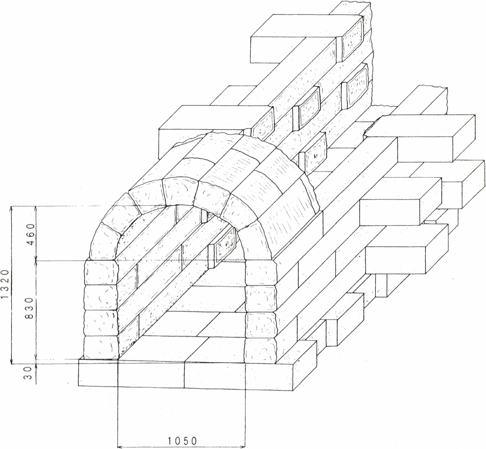

---
link:
  - rel: 'stylesheet'
    href: 'css/main.css'
lang: 'ja'
---
# 2種類のブラフ積についての走り書き

## 2種類のブラフ積についての走り書き

小形克宏

▼

組積造の本質は材質と組積の方法にある。例えば1枚積み、2枚積、2枚半積など組積法が変われば応力が変わり、用途も変わる。よくブラフ積の特徴は一段の中に長手面と小口面が交互に表れるところ等と言われる。しかし表面上の特徴から組積法の違いは一切分からない。材質は一目で分かるが、組積法は解体でもしない限り完全に解明できない。ブラフ積の分かりづらさもここにある。

▼

ブラフ積の生みの母は、横浜市の文化財保護条例「歴史を生かしたまちづくり要綱」（1988年制定、以下「要綱」）である。これは〈景観上重要な歴史的建造物等の外観保存と積極的活用を図るための指導助言と、維持管理、改修等に対する助成をおこなう〉ことを定めたものだ。制定のための実地調査には日本建築学会をはじめ、歴史的建造物の所有者、郷土史研究者やコンサルタントなど幅広い人々が参加し、その結果横浜市内には2,000棟以上の歴史的建造物、2,000件もの旧跡・史跡、200キロメートルにもわたる古道が残っていることが判明した小沢朗「洋館、古民家の保全に助成」（『調査季報』97号、横浜市企画財政局都市科学研究室、1988年）。

ブラフ積が「発見」されたのは、その一環として横浜山手地区でおこなわれた洋館群の実地調査であり、報告者は堀勇良（当時横浜市開港資料館、のち文化庁文化財部参事官）だ。おそらく「要綱」がなければこうした広汎な調査はおこなわれず、ブラフ積が人の目にとまるのはずっと遅れただろう。これに触れた調査報告書は以下の3冊だ。なお、下記3は「要綱」に直接つながる主要な報告書の一つであり、1と2はそれに先行する予備的調査と読める。

1. 堀勇良「震災前山手の異人館」（『昭和59年度横浜山手東部地区洋館群保存対策調査報告書』所収、横浜山手洋館群保存対策調査委員会、1985年3月31日）
2. 『横浜市歴史的環境保全整備調査』横浜市都市計画局都市デザイン課、1985年3月
3. 堀勇良「横浜山手都市形成略史」（『横浜山手　横浜山手洋館群保存対策調査報告書』所収、横浜市教育委員会、1987年3月）

上記2は無署名だが、上記1と重複が多い。たとえば（ブラフ積は）〈長崎、神戸、函館といった他の開港場には見いだすことができないので、〉までは1と2が同文、この後1が〈横浜特有の石積かと思われる〉「震災前山手の異人館」p.10、2が〈横浜山手独特の積み方と考えてよいであろう〉『横浜市歴史的環境保全整備調査』p.121と続く。このことから見て、2の筆者も堀と考えるのが自然だ。つまり「要綱」がブラフ積の母なら、堀はその父と言える。

興味深いのは、上記2で〈今後、何らかの形でこの「ブラフ積」を採り入れることが可能であれば、横浜山手らしさをつくりだしていくうえで有力な景観要素になりえよう〉としていることだ。ここから分かるようにブラフ積は、「歴史を生かしたまちづくり」のため、横浜山手特有の価値を高める景観の一つとして「発見」された。とはいえ調査の主眼はあくまで洋館にあったので、ブラフ積については分布調査や実測調査がおこなわれたものの、組積法を解明するまで至っていない。

ただし、2には石材のサイズについて〈20〜30センチ角、長さ70〜80センチ〉であり、〈小口面を見せている石材を土中に噛みこませる積み方と思われる〉と組積法を推測する記述がある。さらに3では文献調査をおこなって築造年代が明治14年まで遡ることが明らかにされている。

なお、今でも横浜山手に行くと『Bluff Clinic』など「ブラフ」を掲げる店舗や施設があることからも分かるようにThe Bluff Clinic <https://bluffclinic.com/ja/>、「ブラフ」は幕末からつづく同地区の愛称だ。だからこそ1、2では「横浜山手独特の積み方」としてブラフ積と命名されたのだが、2年後の3では「横須賀市内や東京でも多く見かける」と軌道修正されている。しかし命名の根拠がいささか苦しくなっても、名称まで軌道修正されることはなかった。「要綱」を母とするゆえ、変えるに変えられなかったとも想像できる。

▼

<figure style="text-align: center;" class="figure-right">
  
  <figcaption>図1 旧汐留駅プラットフォーム（明治4年11月落成）</figcaption>
</figure>

さて堀が報告した、横浜山手における〈小口面を見せている石材を土中に噛みこませる積み方〉とはどんな積み方なのか。それが分かるのが、明治4年11月に落成した旧新橋駅のプラットフォームの発掘写真である（**図1**）汐留地区遺跡調査会『汐留遺跡　汐留遺跡埋蔵文化財発掘調査報告書（第3分冊）』（1996年、p.17）。長手面が横に、小口面が〈土中に噛みこませる〉よう縦に配置されていることが分かるだろう。写真の石材のサイズは〈幅約30㎝、厚さ22〜24㎝、長さ約85㎝〉であり、横浜山手の石材とは、サイズだけでなく比率もよく似ていることが興味を引く。

なお、新橋〜横浜間で鉄道が開通したのは明治5年10月だが、終点である初代横浜駅の設計者は旧新橋駅と同じリチャード・ブリジェンスであり、両駅は同じデザインだった。とすればプラットフォームにも旧新橋駅と同じブラフ積が使われていたかもしれない。初代横浜駅の落成は明治5年6月。つまり横浜山手のブラフ積より9年も前に、横浜に「ブラフ」積が築造されていた可能性があるのだ。

▼

<figure style="text-align: center;" class="figure-right">
  
  <figcaption>図2 横須賀市東逸見町所在石造暗渠の復原図</figcaption>
</figure>

前述〈土中に噛みこませる積み方〉について、組積法を完全に復原した研究がある。それが横須賀市人文博物館のチームによる「横須賀市東逸見町所在石造暗渠調査報告」である安池尋幸、稲村繁、菊池勝広、大塚眞弘『横須賀市博物館研究報告』（第44号、2000年、p.1）。

これは横須賀市東逸見町3丁目の道路下に残る長さ約6.3メートルの石造水道管を発掘、解体後、別の場所に移設、復原したものだ。一連の徹底した調査の結果、想定復原図が作成されている（**図2**）。みるとボールト天井部を除いた側壁部が、紛れもなく〈石材を土中に噛みこませる〉ブラフ積であることが分かるだろう。

使用されている石材も、概ね幅30㎝、厚さ27㎝、長さ80㎝と横浜山手地区や旧新橋駅とよく似ていることが注目される。築造年代についての明確な証拠はないが、文献調査により1917年〜1921年の間と推測している。

横須賀市の田浦、汐入、上町など、関東大震災前後の町並みが残る地区に残るブラフ積は、まさにこの〈小口面を見せている石材を土中に噛みこませる積み方〉のものと考えられる。

