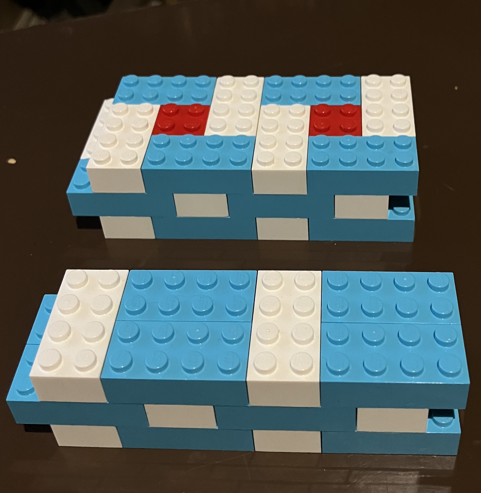

---
link:
  - rel: 'stylesheet'
    href: 'css/main.css'
lang: 'ja'
---
# 2系統のブラフ積についての走り書き

## 2系統のブラフ積についての走り書き

小形克宏

▼

<figure style="text-align: center;" class="figure-right">
  
  <figcaption>図1 レゴブロックによる1枚積（手前）と1枚半積（奥）の 再現。表面の模様は同じことに注意。（筆者撮影）</figcaption>
</figure>

組積造の本質は組積の方法だ。例えば1枚積み長方体の組積造で、奥行きが長手1枚分になる積み方。おもに煉瓦積に使われる。と1枚半積み長方体の組積造で、奥行きが長手1枚分とその半分になる積み方。やはり煉瓦積に使われる。では応力が異なり、自ずから用途も異なる（**図1**）。よくブラフ積は一段の中に長手面と小口面が交互に表れるのが特徴などと言われるが、表面上の特徴から組積法の違いは一切分からない。組積法を完全に解明したければ解体するしかない。ブラフ積の分かりづらさはここにある。

▼

ブラフ積の生みの母は、横浜市の文化財保護条例「歴史を生かしたまちづくり要綱」（1988年制定、以下「要綱」）である。これは〈景観上重要な歴史的建造物等の外観保存と積極的活用を図るための指導助言と、維持管理、改修等に対する助成をおこなう〉ことを定めている。制定のため横浜市全域でおこなわれた実地調査には、日本建築学会をはじめ歴史的建造物の所有者、郷土史研究者やコンサルタントなど幅広い人々が参加した。その結果、横浜市内には2,000棟以上の歴史的建造物、2,000件の旧跡・史跡、100地区にわたる歴史的な景観を呈する地区、200㎞に及ぶ古道が残っていることが判明している小沢朗「洋館、古民家の保全に助成」（『調査季報』97号、横浜市企画財政局都市科学研究室、1988年）。

ブラフ積が「発見」されたのは、その一環として横浜山手地区でおこなわれた洋館群の実地調査であり、報告者は堀勇良（当時横浜市開港資料館、のち文化庁文化財部参事官）だ。「要綱」がなければ広汎な調査もなく、ブラフ積が人の目にとまるのはずっと遅れたのではないか。

〈要綱〉にともなう調査報告書のなかで、ブラフ積に触れたものは以下の3冊だ。なお、下記3は「要綱」に直接つながる主要な報告書の一つであり、1と2は3のための予備的調査と読める。

1. 堀勇良「震災前山手の異人館」（『昭和59年度横浜山手東部地区洋館群保存対策調査報告書』所収、横浜山手洋館群保存対策調査委員会、1985年3月31日）
2. 『横浜市歴史的環境保全整備調査』横浜市都市計画局都市デザイン課、1985年3月
3. 堀勇良「横浜山手都市形成略史」（『横浜山手　横浜山手洋館群保存対策調査報告書』所収、横浜市教育委員会、1987年3月）

上記2は無署名だが、1と重複が多い。たとえば1と2には（ブラフ積は）〈長崎、神戸、函館といった他の開港場には見いだすことができないので、〉という同文の箇所があり、この直後1は〈横浜特有の石積かと思われる〉「震災前山手の異人館」p.10、2は〈横浜山手独特の積み方と考えてよいであろう〉『横浜市歴史的環境保全整備調査』p.121と続く。このことから2の筆者も堀と考えるのが自然だ。「要綱」がブラフ積の母なら、堀はその父と言える。

興味深いのは、上記2で〈今後、何らかの形でこの「ブラフ積」を採り入れることが可能であれば、横浜山手らしさをつくりだしていくうえで有力な景観要素になりえよう〉としていることだ。ここから分かるように、ブラフ積は「歴史を生かしたまちづくり」のため、横浜山手特有の価値を高める景観の一つとして「発見」された。とはいえ調査の主眼はあくまで洋館なので、ブラフ積について分布調査や実測調査がおこなわれたものの、組積法を解明するまでは至っていない。

ただし、2には石材のサイズについて〈20〜30センチ角、長さ70〜80センチ〉であり、〈小口面を見せている石材を土中に噛みこませる積み方と思われる〉と組積法を推測する記述がある。さらに3では文献調査をおこなって築造年代が1881（明治14）年まで遡ることが明らかにされている。

なお、今でも横浜山手に行くと『Bluff Clinic』“The Bluff Clinic” <https://bluffclinic.com/ja/>など「ブラフ」を掲げる店舗や施設があるように、崖をあらわす「ブラフ」は幕末からつづく同地区の愛称だ。だからこそ1、2で「横浜山手独特の積み方」としてブラフ積と命名されたのだが、2年後の3では「横須賀市内や東京でも多く見かける」と軌道修正されている。しかし命名の根拠がいささか苦しくなっても、名称まで軌道修正されることはなかった。母が横浜市の条例だからこそ、変えるに変えられなかったかもしれない。

▼

さて、堀が報告した横浜山手における〈小口面を見せている石材を土中に噛みこませる積み方〉とはどんな積み方なのか。それが分かるのが、1871（明治4）年11月に落成した旧新橋駅のプラットフォームの発掘写真である（**図2**）汐留地区遺跡調査会『汐留遺跡　汐留遺跡埋蔵文化財発掘調査報告書（第3分冊）』（1996年、p.17）。

写真からは長手面が横に、小口面が〈土中に噛みこませる〉よう縦に配置されていることが見て取れる。石材のサイズは高さ約30㎝、厚さ22〜24㎝、長さ約85㎝であり、横浜山手の石材とは、サイズはもちろん比率もよく似ていることが興味を引く。

<figure style="text-align: center;" class="figure-right">
  
  <figcaption>図2 旧新橋駅プラットフォーム</figcaption>
</figure>

なお、初代横浜駅の設計者は旧新橋駅と同じリチャード・ブリジェンスであり、両駅舎は同一のデザインだったナリタノゾミ「明治時代の「初代」横浜駅周辺の風景と駅舎内の様子はどんなかんじ？」（はまれぽ.com <https://hamarepo.com/story.php?story_id=2216>）。とすればプラットフォームにも旧新橋駅と同じブラフ積が使われていた可能性がある。初代横浜駅の落成は1872（明治5）年6月。つまり横浜山手のブラフ積より、9年も前から横浜にブラフ積があったかもしれないのだ。

▼

〈石材を土中に噛みこませる積み方〉について、組積法を完全に復原した研究がある。2000年に発表された横須賀市人文博物館のチームによる「横須賀市東逸見町所在石造暗渠調査報告」である安池尋幸、稲村繁、菊池勝広、大塚眞弘『横須賀市博物館研究報告』（第44号、2000年、p.1）。

これは横須賀市東逸見町3丁目の道路下に残っていた長さ約6.3メートルの石造水道管を発掘、解体後、同市三春町の「下町・トンボ王国」に移築、復原する中でおこなわれた研究だ。一連の調査の結果、想定復原図が作成されている（**図3**）。その側壁部をみると、紛れもなく〈石材を土中に噛みこませる〉系統のブラフ積であることが分かるだろう。

<figure style="text-align: center;" class="figure-right">
  
  <figcaption>図3 横須賀市東逸見町所在石造暗渠の復原図</figcaption>
</figure>

使用されている石材も、概ね高さ30㎝、厚さ27㎝、長さ80㎝と横浜山手地区や旧新橋駅とよく似ていることが注目される。築造年代についての明確な証拠は見つからなかったが、文献調査により1917（大正6）年〜1921（大正10）年と推測している。

この研究が画期的な点は、広く文献を渉猟することで、堀の命名以前から〈フランス積み風の石積〉〈1番3番積〉〈1本控え〉など複数の呼称が存在したこと、また横浜市や横須賀市以外にも〈群馬県旧信越本線碓氷峠の明治期建造の鉄道トンネルや鹿児島県鹿児島市に類似の石積が確認でき、その分布はある程度広範囲であることが想起される〉と指摘していることだ前掲『横須賀市博物館研究報告』p.18。さらに1928（昭和3）年の汐入尋常小学校（現在の汐入小学校）の工事風景を撮した写真を掲載し、〈石材を土中に噛みこませる〉工法の実際の姿を明らかにしている（**図4**）前掲『横須賀市博物館研究報告』p.18「改築落成記念絵葉書」（汐入尋常小学校、1928年12月9日）。

<figure style="text-align: center;" class="figure-right">
  
  <figcaption>図4 汐入尋常小学校の建築写真（提供：久保木実氏）</figcaption>
</figure>

▼

行き届いた研究だけに付け加えることは少ないが、『横須賀市震災誌附復興誌』横須賀市震災誌刋行會、1932年（復刻：横須賀郷土資料復刻刊行会、1981年）により、震災後に横須賀市内で築造されたブラフ積の竣工年が分かることを報告したい。

太平洋戦争期に大空襲を逃れた横須賀の町並みが、横浜や川崎と違って関東大震災だけを画期とすることはよく知られている。たとえば図3で紹介した汐入尋常小学校も大きな被害を受けており、震災復興計画の一環として現在も校地に残るブラフ積が築造されたことが同書で分かる前掲『横須賀市震災誌附復興誌』p.313。

同様に、市内のブラフ積としては大規模な部類に属する長源寺坂（同市汐入3丁目26番地付近）の遺構は、同書「震災害󠄂復舊工事一覽󠄁表」によれば1927（昭和2）年3月8日に予算590円で着工し、同年3月31日に竣工前掲『横須賀市震災誌附復興誌』p.333、口絵には完成したばかりのブラフ積の写真が掲載されている。この表を使うことで現在市内各地に残る遺構の築造時期を知る手がかりが得られそうだ。なお、管見の限りでは、汐入小学校、長源寺坂をはじめ市内に残るブラフ積のサイズは、いずれも堀が横浜山手で観察したのと近似した〈20〜30センチ角、長さ70〜80センチ〉のものばかりである。

▼

以上述べてきたブラフ積は、いずれも旧新橋駅プラットフォームにおける石材のサイズ、高さ約30㎝、厚さ22〜24㎝、長さ約85㎝に近似したもの、言い換えると表面に現れる高さ対長さの比率が概ね1対3のもので、かつ〈石材を土中に噛みこませる〉系統のものばかりだ。以下、これらのブラフ積を「1対3のブラフ積」と呼ぶ。

<figure style="text-align: center;" class="figure-right">
  
  <figcaption>図5 千代ヶ崎砲台の擁壁遺構（筆者撮影）</figcaption>
</figure>

ここで、組積造ではサイズが組積法までを規定してしまうことを確認しておきたい。たとえば1対3の比率の石材を使って、1枚積、1枚半積で築造することは原理的に不可能だ。これらの組積法は高さ対長さが1対2でなければ成立しないのだ。冒頭で組積造の本質は組積方法といったのは、このことだ。

その上で私がお伝えしたいのは、ブラフ積にはもう1つの系統、煉瓦積と同じ「1対2のブラフ積」があるのではないかということだ。

**図5**をご覧いただきたい。これは国史跡東京湾要塞跡千代ヶ崎砲台跡（横須賀市西浦賀6丁目5-1）に隣接した私有地内に残る、同砲台の擁壁である土地所有者の許可をいただき撮影、掲載した。

土中にどのくらい埋もれているか不明だが、土の上に数㎝だけ表れている段があり、その上に2段、合わせて3段分が煉瓦積でいう1枚半積（図1、奥）、その上に乗った8段分が同じく1枚積（図1、手前）であり、さらにその上に1段分の天端石が乗っていることが分かる。材質は天端石もふくめ、千代ヶ崎砲台跡敷地内のものと同じ凝灰質礫岩のようだ。

この組積法は、〈石材を土中に噛みこませる〉ものとは本質的に系統が異なる。ここでもう1つの系統と提唱するゆえんである。なお、