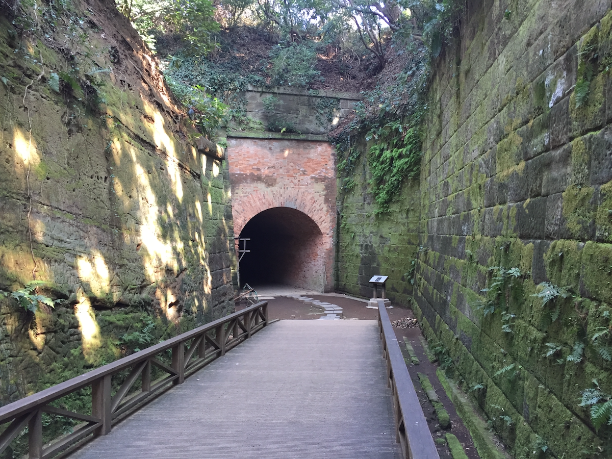
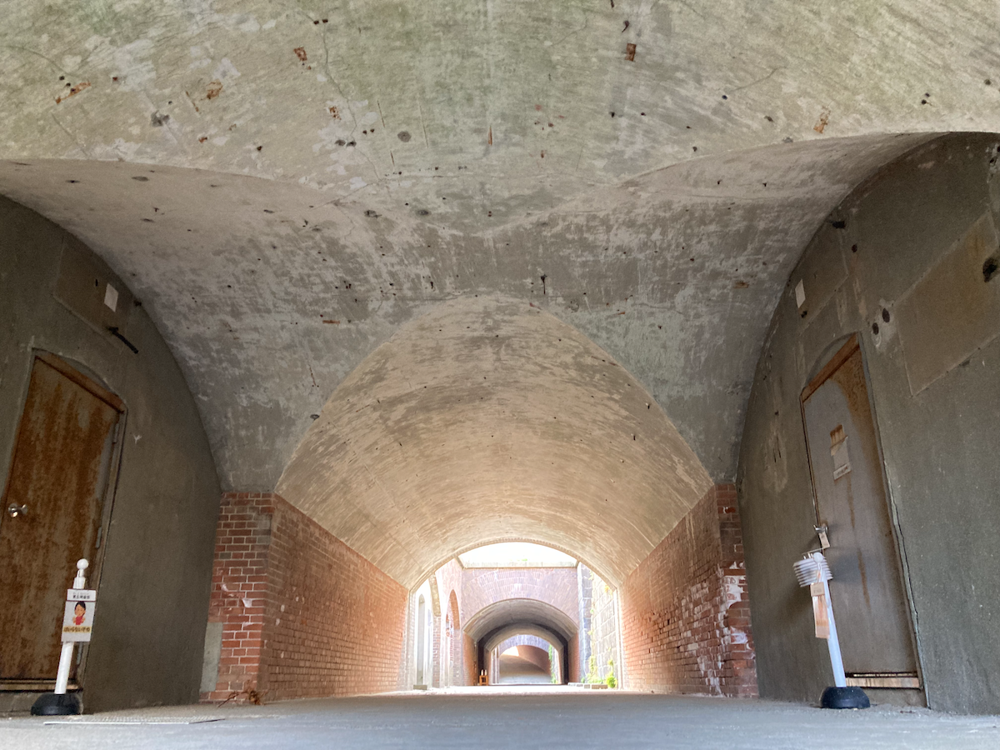
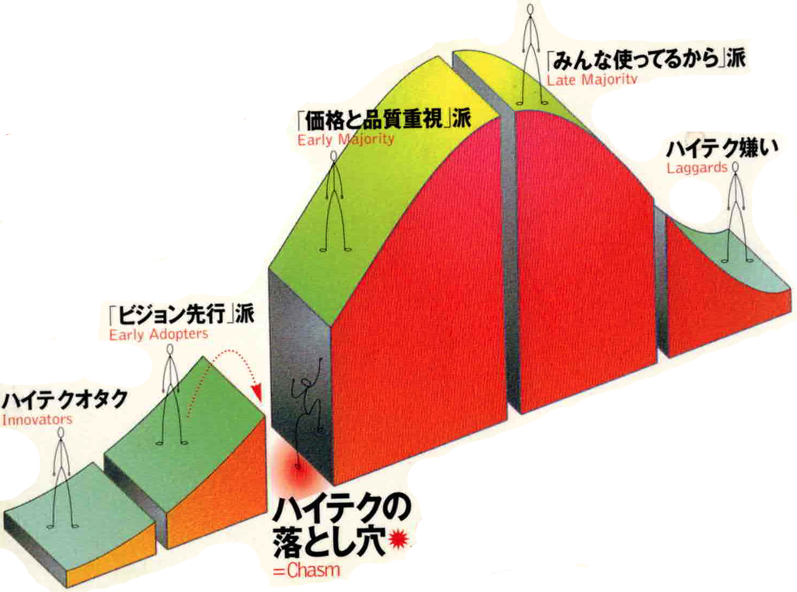

---
link:
  - rel: 'stylesheet'
    href: 'css/main.css'
lang: 'ja'
---
# 赤シャツと砲台

小形克宏

## Ⅰ 2つの砲台

### 45年もつづいた明治

1年ほど前から月に何回か、地元横須賀市にある明治期に築造された軍事史跡、{千|ち}{代|よ}{ヶ|が}{崎|さき}{砲台跡|ほうだいあと}でボランティアでガイドをしている。煉瓦や石積、コンクリートの中で、ゲストにこの砲台がどのようにして作られたのかを話しているうち、やがて明治という時代の成り立ちについて考えをめぐらすようになった。

明治という時代は45年もある。その最初の頃は時代劇でお馴染み、{丁髷|ちょんまげ}と二本差しのお侍さんがまだいた時代（廃刀令布告は明治9年）。では最後の頃はどういう時代かというと、夏目漱石『坊っちゃん』の時代なのだ。

この小説の初版は明治39年。その最後の部分を開いてみると、愛媛松山から東京に帰った主人公は、「{街鉄|がいてつ}の{技手|ぎしゅ}になった」とある。街鉄とは後に市電、都電になった、都会を走る路面電車。つまり、この小説が書かれた頃、すでに東京を路面電車が走っていた。丁髷に{羽織|はおり}{袴|はかま}、刀を差したお侍さんが{闊歩|かっぽ}する時代から、ビル街の中を鋼鉄製の路面電車が人々を運ぶ時代へ。明治の45年間で、日本はすさまじい変化を遂げている。

明治という時代を理解するには、大日本帝国憲法が公布された明治22（1889）年を境に前半と後半に分けて考えるとよい。前半は西洋技術を必死になって習得した「試行錯誤の時代」、そして後半はそれを自分のものにした「余裕の時代」、この2つは明確に違う。

### 猿島砲台の試行錯誤

私がガイドをやっている千代ヶ崎砲台は、明治25（1892）年12月に起工、同28（1895）年2月に竣工している。前述した分節点、明治22年から見ると、千代ヶ崎砲台ができた明治25年は明治の後半がスタートした頃。一方、これとよく対比されるのが同じ横須賀市内にある東京湾最大の自然島、猿島にある{猿島砲台|さるしまほうだい}。こちらは明治17（1884）年6月、つまり明治の前半が終わろうとする時期に、およその工事が終わっている。

千代ヶ崎砲台の工事期間を指折り数えると、たった27ヵ月で完成している。それに対して猿島砲台は工事が難航した。起工は千代ヶ崎砲台が完成する14年前の明治14（1881）年4月。その3年後、前述したように明治17年6月に基本的な工事が終わっている。ただし、その後も不具合の修理や計画変更がつづき、最終的な竣工は起工から21年もたった明治35（1902）年3月までずれこんでいる。

実際に猿島砲台と千代ヶ崎砲台に行ってみると分かるが、両者の間には明らかな変化が見て取れる。猿島砲台は試行錯誤、千代ヶ崎砲台は余裕。

### 千代ヶ崎砲台の余裕

千代ヶ崎砲台に立って見渡すと、すでに西洋技術を自分のものにしたという余裕を感じる。より早く効率的に、より堅固に積まれた煉瓦の{組積|そせき}。実用的なだけでない。石積と煉瓦積が絶妙な曲線で折り重なる造形、ドーム天井に切り欠かれたエッジを浮き上がらせるコンクリートの打設。そんな美しい意匠であふれている。

一方、千代ヶ崎砲台ができる14年前に起工された猿島砲台も愛おしい。組積方法の異なる煉瓦積が混在するなど、これをしたらダメだったけど、こうやったらうまくいったというような試行錯誤と悪戦苦闘の跡があちらこちらで見て取れる。そうか、日本人は煉瓦積などの西洋技術を、こうやって自分のものにしたんだなと納得できる。

{width=800}
{width=800}

## Ⅱ 嫌われ者、赤シャツ

### 西洋かぶれの俗物

そのように思い至ったとき、浮かんだのが赤シャツだった。赤シャツは『坊っちゃん』の印象的な悪役だ。暑くても赤いネルのシャツを着て、琥珀のパイプを絹のハンカチで磨き、「ホホホ」と笑う嫌みな男。小説が書かれた当時まだ全国に2つしかなかった帝国大学を卒業した文学士で、インテリ御用達の雑誌『帝国文学』をありがたそうに読む（主人公は専門学校、現在の私立大学の卒業）。松を見ればターナーの絵のようだ、釣り上げた雑魚の名前がロシアの文学者に似ていると、誰も知らない西洋人の名前を持ち出して、自分がインテリであることをひけらかす。挙げ句、すでに婚約者のいるマドンナに横恋慕し、策略を巡らして自分のものにしようとする。

鼻持ちならない西洋かぶれの俗物であり、読者は誰もが赤シャツを嫌うように設定されている。『坊っちゃん』を短く要約すれば、短気で単細胞だが正義感あふれる主人公が、憎むべき赤シャツを懲らしめ、読者は溜飲を下げるという小説なのだ。

### 赤シャツが生まれた背景

なるほど、明治も末になると赤シャツ的な人物がそこここで悪臭を放っていたようだ。その鼻をへし折ってスッとしたいと思う人も少なからずいたのだろう。「坊っちゃん」が発売後、好評のうちに版を重ねたのは、そういうことを意味するのではないか。

赤シャツが西洋かぶれの悪役とすれば、煉瓦積でできた砲台との共通点は「西洋の知識」ということになる。その意味から、砲台を作ったものが、やがて赤シャツを生んだと言ってよいかもしれない。

ただし、旧陸軍の砲台は高まる日清戦争の危機に対処するため、膨大な資金を注ぎ込んで欧州帰りのエリート技術将校の指揮で作られた国防施設なのに対し、赤シャツの方は薄っぺらな一人の田舎中学の教頭に過ぎない。同じ西洋の知識のシンボライズが、明治末年にはなぜここまで落ちぶれてしまったのか、考えてみると不思議に思える。

## Ⅲ「キャズム」は越えられるか

### ハイテクの受容過程をパターン化

そこで思い出したのが、かつてIT業界を席巻したマーケティング理論、ジェフリー・ムーアによる[『キャズム』（訳／川又政治、2002年、翔泳社）](https://www.shoeisha.co.jp/book/detail/9784798101521)だった。これが日本における西洋の知識の受容にも当てはまるのではないか。

ムーアは長年アメリカのハイテク業界でマーケティング・コンサルタントをつとめた経験から、多くのハイテク製品が誕生から普及まで、ある一定のパターンを辿ることに気付いた。これを理論化したのが本書だ。彼は革新的な技術を使ったハイテク製品が社会に受けいられていくプロセスを、以下のような不連続な顧客層に、順繰りに受け入れられていくものとして捉えた。

1. **イノベーター**（テクノロジー・マニア）……革新技術が大好き、実用よりその技術を使えることが大事
2. **アーリー・アダプター**（ビジョナリー）……前者よりも実用指向。大きなビジョンを持っていて、その実現に革新技術を利用しようとする
3. **アーリー・マジョリティー**（実利主義者）……前者と似るが、さらに実用と確実な成果を好む。導入事例を確認してから購入する
4. **レイト・マジョリティ**（保守派）……前者と似るが製品があまり好きでない。多機能がセットになったパッケージ製品を安価で買いたがる
5. **ラガード**（懐疑派）……革新的なハイテク製品に興味がない。大量一括購入によりハイテク製品のユーザーになる

### 多くの製品が越えられない「谷間」

その上で、多くのハイテク製品が上記2から3への移行の段階で消えてゆくことから、ここに「キャズム」（chasm／割れ目、谷間）があり、それを乗り越えることこそがハイテク製品の死命を制すると説く。

このキャズム理論で興味深いのは、発売当初は革新的な技術を熱愛する顧客層に受容されるが、普及するにつれて少しずつ技術への関心がより薄い顧客層に使われるようになるということ。つまり製品の普及率が上がるにつれて、その製品を実現する革新技術への関心が下がるという反比例の関係にある。

そしてもう一つ、当初は技術に熱中するあまり二の次だった実用性が、普及が進むとともに重視されるようになり、やがて不可欠、というよりあって当然のものとして扱われるようになる。最近の言葉で言うコモディティ化だ。

もしかしたらこれとよく似たパターンが、西洋の知識の受容をめぐって江戸期から明治期の日本でもおき、その課程の最後として赤シャツという嫌われ者を生むに至ったのではないだろうか。

### 江戸中期のイノベーター、蘭方医

ムーアの言う5つの顧客層を、日本の近代史の中で探してみよう。果たしてうまく当てはまるだろうか。まず最初のイノベーター（テクノロジー・マニア）は江戸中期の蘭方医、{前|まえ}{野|の}{良|りょう}{沢|たく}と{杉|すぎ}{田|た}{玄白|げんぱく}だ。

玄白が自ら[『蘭学事始』](https://dl.ndl.go.jp/pid/826051/1/32
)で記すところによると、2人は千住小塚原の刑場に夜半密かに入って{刑|けい}{屍|し}（処刑された死体）の解剖に同席し、切り出された臓器と持ち込んだオランダの医書『ターヘル・アナトミア』を一つ一つ照らし合わせたという。鬼気迫る光景だが、その結果オランダの医書がきわめて正確であるのに対し、自分たちが今まで学んできた東洋医術には何一つ正しいものがないことが分かり、深く恥じるようになる。

2人はこの体験から『ターヘル・アナトミア』を翻訳して、西洋の知識と技術を日本に広めることを決意する。これが安永3（1774）年に出版された『解体新書』だ。日本の近代はまさにこの「現物を見て納得する」という合理精神から始まった。同時にいかにもテクノロジー・マニアらしいクレイジーなエピソードと言える。

### アーリー・アダプターとしての殿様

次のアーリー・アダプター（ビジョナリー）とは、明確なビジョンを持ち、その実現に革新技術を利用しようとする人々だという。

江戸後期から幕末まで、巨大な資本を投下し、率先して西洋の技術を導入しようとした人々がいた。江戸後期に異国船を撃退するため大型の洋式砲を作ろうとした{江|え}{川|がわ}{英龍|ひでたつ}、{鍋島閑叟|なべしまかんそう}、{島|しま}{津|づ}{斉|なり}{彬|あきら}、そして{徳川斉昭|とくがわなりあき}といった、後に明君と呼ばれる殿様たち。彼等にとって伝統的な製鉄法はあまりに生産性が低かった。そこで大量の鉄を調達するために、なんと西洋式の製鉄炉の自作から始めたのだ。

彼等はそうした気の遠くなるような回り道をしてでも西洋から日本を守らねばならぬという強固なビジョンと、それを可能にする資本と労働力をもっていた。そんな彼等にとって西洋の知識は自分のビジョンを実現する実用的な道具に過ぎない。

とはいえ、彼等はいずれも「西洋を撃退するには、西洋の技術が不可欠」という自己矛盾を抱えていた。これは彼等のみならず、当時の日本の矛盾そのものだ。それゆえ、その解消方法をめぐって以降の国論は真っ二つに分かれた。つまり、現実を棚上げして撃退を急ぐべきという攘夷派と、現実を受け入れて撃退を先延ばしすべきという開港派だ。

### 状況を一変させた開港

この状況が変わるのは1859（安政6）年、攘夷派を力ずくで押さえ込んだ大老{井|い}{伊|い}{直弼|なおすけ}によって長崎、横浜、函館が欧米諸国に開港された時だ。開港を待ちかねていた欧米の貿易商人達はさっそく各地の開港地で店を開いたから、そこに行ってお金さえ払えば、西洋の産物が買えるようになる。もちろんこれは禁制の密貿易だが、大老を江戸城の目前で反対勢力にみすみす殺されるのを許してしまった幕府に、もはや密貿易を取り締まる権威はない。

この開港により、大砲を作るために膨大な資本と労力を投入して製鉄炉を作るところから始めなければならなかった状況は終わりを告げる。必要なのはお金だけ。その結果、西洋の知識への需要はますます高まることになる。

そこで多く求められたものが、折りから風雲急を告げる国内状況に必要な軍需物資、つまり銃、大砲、弾丸、火薬などだった。日本中の藩が借金に借金を重ね、競うようにして西洋式軍隊の整備をすすめる。これが次の状況、戊辰戦争を引き起こす引き金となり、同時にこの状況が西洋の知識、言い換えれば日本の近代化における最大の難関、「キャズム」を越える原動力となるのである。

未完

---

<dl class="okuduke">
  <dt>発　行</dt>
  <dd>2023（令和5）年10月31日</dd>
  <dt>著　者</dt>
  <dd>小形　克宏</dd>
  <dt>発行者</dt>
  <dd>小形　克宏（ogwata@mac.com）</dd>
  <dt>印刷所</dt>
  <dd>欧文印刷株式会社</dd>
</dl>
